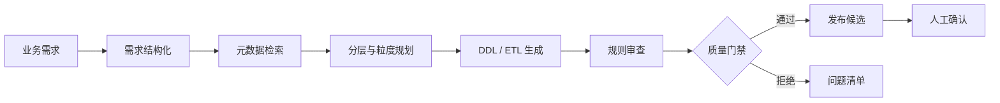

# TangBuy Data Warehouse Agent Showcase

一个面向数据仓库研发流程的安全展示项目，演示如何将业务需求转化为可审查的数据模型与 SQL 交付物。

> 本仓库是经过脱敏和重新实现的公开展示版，不包含原生产仓库的 Git 历史、真实源表 Schema、生产 ETL、公司业务口径、账号配置、客户数据或云端凭据。

## 项目目标

传统数仓研发需要在需求理解、资产检索、分层建模、SQL 编写、代码审查和发布验证之间反复切换。本项目将这些步骤组织为一个可追踪的 Data Agent 流水线：



## 展示能力

- 将自然语言需求解析为指标、维度、粒度和时间范围。
- 从允许公开的演示元数据中检索候选表与字段。
- 按 ODS、DIM、DWD、DWS、ADS 分层原则生成模型规划。
- 生成带分区约束的 MaxCompute 风格 DDL/ETL 草稿。
- 通过确定性规则阻断 `SELECT *`、缺失分区过滤和 DWS 直读 ODS 等问题。
- 输出发布候选和审查证据；展示版不会连接真实 DataWorks 或执行云端写入。

## 目录

```text
.
├── docs/                    # 架构、安全边界和脱敏说明
├── examples/                # 匿名化需求、元数据和 SQL 示例
├── src/tangbuy_agent/       # Data Agent 最小工程实现
└── tests/                   # 确定性质量门禁测试
```

## 快速运行

需要 Python 3.11+：

```bash
python -m pip install -e .
python -m tangbuy_agent.cli examples/request.json examples/metadata/catalog.json
python -m unittest discover -s tests -v
```

## 安全设计

- 所有连接配置必须来自环境变量或外部密钥管理系统。
- 仓库不接受真实服务账号 JSON、AK/SK、Token、Webhook 或数据库连接串。
- 示例数据仅描述虚构的电商场景，不包含真实用户、订单、店铺和客户信息。
- 发布步骤默认是 dry-run，真实平台写入必须由人工确认并在私有环境实现。

详细说明见 [SECURITY.md](SECURITY.md) 和 [脱敏报告](docs/SANITIZATION_REPORT.md)。
